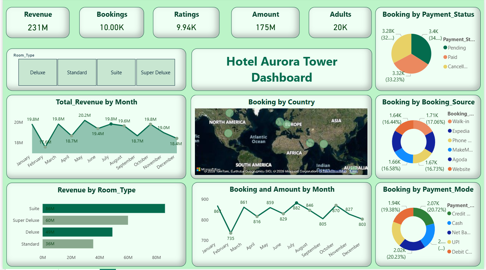

# 🏨 Hotel Aurora Tower Dashboard

An advanced Power BI Hotel Analytics Dashboard designed to evaluate booking performance, revenue growth, guest demographics, and room category trends.
This project highlights how raw hospitality data can be converted into clear, interactive visual insights that assist in strategic business decisions.

# 📌 Project Overview

The Hotel Aurora Tower Dashboard provides insights into:

✔ Booking patterns across multiple booking channels

✔ Revenue performance and pricing trends

✔ Country-wise guest distribution

✔ Room category demand analysis

✔ Month-wise booking and revenue performance

✔ Payment tracking and rating insights

Instead of analyzing spreadsheets manually, this dashboard offers a dynamic and user-friendly decision-support system.

# 🎯 Objective

The primary aim of this project is to:

1. Transform raw hotel booking data into actionable insights

2. Detect high-performing booking platforms and room categories

3. Monitor monthly revenue and occupancy trends

4. Examine customer distribution and travel behavior

5. Implement a real-world hospitality analytics workflow

# 🛠️ Tech Stack Used

📊 Power BI Desktop – Data visualization and report building

📂 Power Query – Data preprocessing and transformation

🧠 DAX – Calculated measures and KPIs

📁 Microsoft Excel – Raw dataset source

🗂 Data Modeling – Relationship building and filtering logic

# 📂 Data Source

The dataset is an Excel-based hotel booking dataset including:

1. Transaction-level booking records

2. Booking channels (Walk-in, Expedia, Agoda, Website, etc.)

3. Room categories (Standard, Deluxe, Suite, Super Deluxe)

4. Guest country information

5. Monthly revenue and booking data

6. Payment status and customer ratings

The dataset represents a realistic hotel business environment for analysis purposes.

# 📊 Dashboard Features & Insights
***🔢 Key Performance Indicators (KPIs)***

1.Total Revenue: 231M

2.Total Booking Amount: 175M

3. Room Rate: 50M

4.Total Adults: 20K

5.Total Ratings: 9.94K

These KPIs provide a quick and comprehensive performance summary.

# 🏨 Booking Channel Analysis

Displays booking share across:

1. Walk-in

2. Expedia

3. Agoda

4. Website

5. MakeMyTrip

➡ Identifies dominant booking platforms.

# 🛏 Room Category Analysis

Compares performance of:

1. Standard

2. Deluxe

3. Suite

4. Super Deluxe

➡ Supports pricing strategy and inventory planning.

# 🌍 Guest Location Analysis

Interactive map showing country-wise booking distribution.

➡ Highlights domestic and international travel contribution.

# 📅 Revenue Trend Analysis

Monthly revenue visualization to detect seasonality patterns.

➡ Helps in forecasting demand cycles.

# 📆 Booking Volume Trend

Tracks month-wise booking count.

➡ Supports occupancy planning and business forecasting.

# 💳 Payment Status Overview

Breakdown of:

1. Paid

2. Pending

3. Cancelled

➡ Assists in monitoring cash flow and cancellation trends.

# 💡 Key Business Insights

✔ Online booking platforms contribute significantly to total bookings.

✔ Premium room categories generate higher revenue share.

✔ International travelers play a crucial role in revenue contribution.

✔ Revenue shows seasonal fluctuations during peak months.

✔ Payment completion rate remains strong overall.

# 📷 Dashboard Preview

